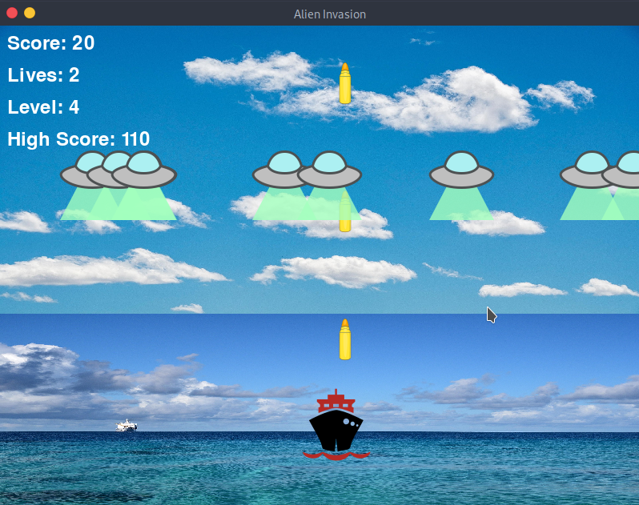

<h1 align="center">Alien-Invasion </h1>

<div align="center">



</div>

## Game Description

Alien Invasion is an exciting game where the player controls a ship at the bottom of the screen. The player can move the ship left and right using the arrow keys and shoot bullets with the spacebar. As the game begins, a fleet of aliens fills the sky, moving across and down the screen. The player's objective is to shoot and destroy the aliens. When all aliens are destroyed, a new, faster fleet appears. The game ends if an alien hits the player's ship or reaches the bottom of the screen, and the player loses a ship. The game is over when the player loses three ships. The game is built using the Pygame library for game functionalities and the SYS module to handle game exits.

## Installation 

To install the necessary dependencies, run:

```sh
pip install -r requirements.txt
```

## Usage

To start the game, run:

```sh
python main.py
```

Alternatively, to start the game with icons on the dashboard, run:

```sh
python main.icons.py
```

## Assets

### Audio

| Description | Link |
|-------------|------|
| Shoot       | [Sci-Fi Weapon Shoot](https://pixabay.com/sound-effects/sci-fi-weapon-shoot-firing-pulse-tm-04-233827/) |
| Hit         | [Sci-Fi Weapon Hit](https://pixabay.com/sound-effects/sci-fi-weapon-shoot-firing-pulse-tm-01-233821/) |
| Cinema Hit  | [Cinematic Hit](https://pixabay.com/sound-effects/cinematic-hit-159487/) |
| Background Music | [Journey Into Space](https://pixabay.com/music/build-up-scenes-journey-into-space-235266/) |
| Game Over   | [Game Over Sound Effect](https://pixabay.com/sound-effects/game-over-2-sound-effect-230463/) |

### Images

| Description | Link |
|-------------|------|
| Ship        | [Ship Icon](https://icon-icons.com/download/34102/PNG/96/) |
| Alien       | [Alien Icon](https://icon-icons.com/download/60295/PNG/96/) |
| Bullet      | [Bullet Icon](https://www.flaticon.com/free-icon/war_12652069?term=bullet+shot&page=1&position=32&origin=tag&related_id=12652069) |
| Powerup     | [Powerup Icon](https://icon-icons.com/download/54192/PNG/96/) |
| Sea         | [Sea Image](https://pixabay.com/photos/ocean-rangiroa-sea-clouds-water-7335499/) |
| Sky         | [Sky Image](https://pixabay.com/photos/sky-clouds-atmosphere-weather-7158340/) |

## Icons

- [x] [Icon-Icons](https://icon-icons.com)

## License

This project is licensed under the MIT License. See the [LICENSE](LICENSE) file for details.
